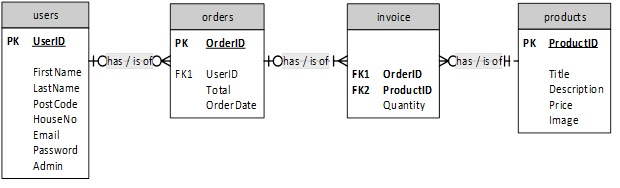

# PHP E-commerce website

## Description

A simple E-commerce web application aiming to provide a secure and interactive platform. This web app contains a range of core components implemented from scrach 
such as login/registration, search functionality, shopping cart, admin functionality handling users and products, etc. 
This project was part on an assignment focusing on security aspects like prepared statements, secure form submission, handling session cookies, etc.

### Database design - Entity Relationship Diagram 

*MySQLi is used to enable access and to facilitate data manipulation contained in the database.

    

### Admin page

*The UML below displays the classes, including their components (properties and methods) and the relationships between them.

    

## Getting Started

To access the website, access: http://andreiioanb4889.ccacolchester.com/web3/index.php

## Acknowledgments

* PHP documentation
* JavaScript documentation
